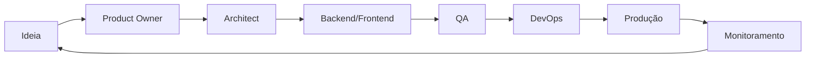

# Evolua CRM - Projeto AI-Native

Este repositório foi transformado em um ambiente **AI-native** onde AI agents podem desenvolver, manter e evoluir o sistema de forma autônoma.

## 📁 Estrutura do Projeto

```
.
├── .claude/                    # Contexto global para IA
│   └── claude.md              # Manual operacional da IA
├── agents/                     # Agents especializados
│   ├── product-owner.agent.md # Requisitos e produto
│   ├── architect.agent.md     # Arquitetura e design
│   ├── backend.agent.md       # Implementação backend
│   ├── frontend.agent.md      # Implementação frontend
│   ├── devops.agent.md        # Infraestrutura e deploy
│   └── qa.agent.md            # Qualidade e testes
├── skills/                     # Conhecimento reutilizável
│   ├── backend.skill.md       # Padrões de backend
│   ├── frontend.skill.md      # Padrões de frontend
│   ├── security.skill.md      # Segurança
│   ├── devops.skill.md        # DevOps
│   └── testing.skill.md       # Testes
├── spec/                       # Especificações do sistema
│   ├── project-analysis.md    # Análise completa do projeto
│   ├── product.md             # Visão de produto
│   ├── architecture.md        # Arquitetura do sistema
│   ├── backend.md             # Especificação backend
│   ├── frontend.md            # Especificação frontend
│   ├── infrastructure.md      # Infraestrutura
│   ├── api.md                 # Documentação de APIs
│   ├── ai-workflow.md         # Workflow de desenvolvimento
│   └── mcp-architecture.md    # Integração MCP
└── frontend-evolua/            # Código fonte (Next.js)
```

## 🤖 Agents Especializados

### Product Owner Agent
**Responsabilidade**: Definir requisitos, priorizar features, validar entregas
**Arquivo**: `agents/product-owner.agent.md`

### Architect Agent
**Responsabilidade**: Definir arquitetura, padrões técnicos, escalabilidade
**Arquivo**: `agents/architect.agent.md`

### Backend Agent
**Responsabilidade**: Implementar APIs, lógica de negócio, integração com banco
**Arquivo**: `agents/backend.agent.md`

### Frontend Agent
**Responsabilidade**: Construir UI, gerenciar estado, garantir UX
**Arquivo**: `agents/frontend.agent.md`

### DevOps Agent
**Responsabilidade**: Gerenciar infraestrutura, CI/CD, monitoramento
**Arquivo**: `agents/devops.agent.md`

### QA Agent
**Responsabilidade**: Garantir qualidade, criar testes, validar requisitos
**Arquivo**: `agents/qa.agent.md`

## 📚 Skills Reutilizáveis

Skills são módulos de conhecimento que podem ser usados por múltiplos agents:

- **backend.skill.md**: Design de APIs, arquitetura de serviços, tratamento de erros
- **frontend.skill.md**: Composição de UI, gerenciamento de estado, acessibilidade
- **security.skill.md**: Autenticação, autorização, sanitização, LGPD
- **devops.skill.md**: Docker, CI/CD, infraestrutura como código
- **testing.skill.md**: Pirâmide de testes, property-based testing, cobertura

## 📋 Especificações

### Documentação de Produto
- **product.md**: Visão do produto, personas, jornadas, métricas
- **project-analysis.md**: Análise completa do sistema atual

### Documentação Técnica
- **architecture.md**: Arquitetura geral, componentes, escalabilidade
- **backend.md**: Padrões de backend, módulos, DTOs
- **frontend.md**: Estrutura de componentes, hooks, estado
- **infrastructure.md**: Cloud, CI/CD, monitoramento
- **api.md**: Endpoints, contratos, autenticação

### Workflow e Integração
- **ai-workflow.md**: Ciclo de vida do desenvolvimento com IA
- **mcp-architecture.md**: Integração com Model Context Protocol

## 🚀 Como Usar

### Para Desenvolvedores Humanos

1. **Ler o Manual da IA**: `.claude/claude.md`
2. **Consultar Specs**: `spec/` para entender o sistema
3. **Seguir Padrões**: `skills/` para implementações
4. **Interagir com Agents**: Usar agents para tarefas específicas

### Para AI Agents

1. **Carregar Contexto**: Ler `.claude/claude.md` primeiro
2. **Identificar Papel**: Escolher agent apropriado (`agents/`)
3. **Consultar Skills**: Usar `skills/` para padrões de implementação
4. **Seguir Workflow**: Seguir `spec/ai-workflow.md`
5. **Atualizar Specs**: Manter `spec/` atualizado

## 🔄 Workflow de Desenvolvimento



### Exemplo: Nova Feature

1. **Product Owner**: Cria user story em `spec/product.md`
2. **Architect**: Define arquitetura em `spec/architecture.md`
3. **Backend**: Implementa API seguindo `skills/backend.skill.md`
4. **Frontend**: Implementa UI seguindo `skills/frontend.skill.md`
5. **QA**: Valida com testes seguindo `skills/testing.skill.md`
6. **DevOps**: Deploy seguindo `skills/devops.skill.md`

## 🔌 Integração MCP

O projeto suporta Model Context Protocol para estender capacidades dos agents:

- **GitHub MCP**: Gerenciamento de issues e PRs
- **Supabase MCP**: Gerenciamento de banco e auth
- **AWS MCP**: Deploy e monitoramento
- **Custom MCP**: Servidores específicos do Evolua

Ver `spec/mcp-architecture.md` para detalhes.

## 📊 Métricas de Qualidade

### Código
- **Cobertura de Testes**: >80%
- **TypeScript Strict**: Ativado
- **ESLint**: Sem erros
- **Bundle Size**: <500KB

### Performance
- **Lighthouse Score**: >85
- **First Contentful Paint**: <1.5s
- **Time to Interactive**: <3s

### Segurança
- **CSP**: Implementado
- **HTTPS**: Forçado (HSTS)
- **Rate Limiting**: Ativo
- **Input Sanitization**: Implementado

## 🛠️ Comandos Úteis

```bash
# Desenvolvimento
npm run dev              # Rodar em modo dev
npm run build            # Build de produção
npm run lint             # Rodar ESLint
npm run test             # Rodar testes

# Análise
npm run type-check       # Verificar tipos TypeScript
```

## 📖 Documentação Adicional

- **Next.js**: https://nextjs.org/docs
- **React Query**: https://tanstack.com/query/latest
- **Supabase**: https://supabase.com/docs
- **Tailwind CSS**: https://tailwindcss.com/docs
- **shadcn/ui**: https://ui.shadcn.com

## 🤝 Contribuindo

### Para Humanos
1. Ler `.claude/claude.md` para entender padrões
2. Seguir convenções de código
3. Escrever testes
4. Atualizar documentação

### Para AI Agents
1. Identificar agent apropriado
2. Seguir workflow em `spec/ai-workflow.md`
3. Usar skills para implementação
4. Atualizar specs conforme necessário

## 📝 Licença

[Adicionar licença aqui]

## 🙋 Suporte

Para dúvidas sobre o projeto AI-native:
- Consultar `.claude/claude.md`
- Revisar `spec/ai-workflow.md`
- Verificar `agents/` para responsabilidades

---

**Transformado em AI-Native em**: 2026-02-19
**Versão**: 1.0.0
