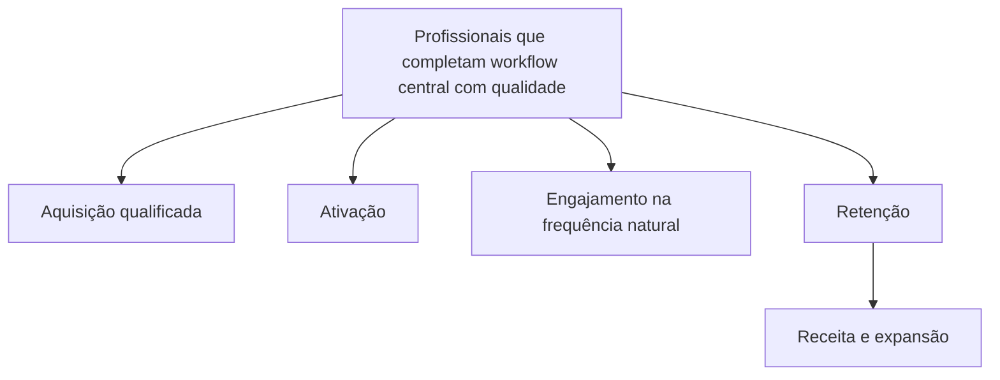

# Metric Tree — Proposed

```mermaid
flowchart TD
  N[Profissionais que completam workflow central com qualidade] --> A[Aquisição qualificada]
  N --> AC[Ativação]
  N --> E[Engajamento na frequência natural]
  N --> R[Retenção]
  R --> RV[Receita e expansão]
```

É uma candidata a North Star, não métrica atual. Guardrails: falhas de salvamento, suporte, tempo de workflow, incidentes de privacidade e qualidade/revisão de IA.
