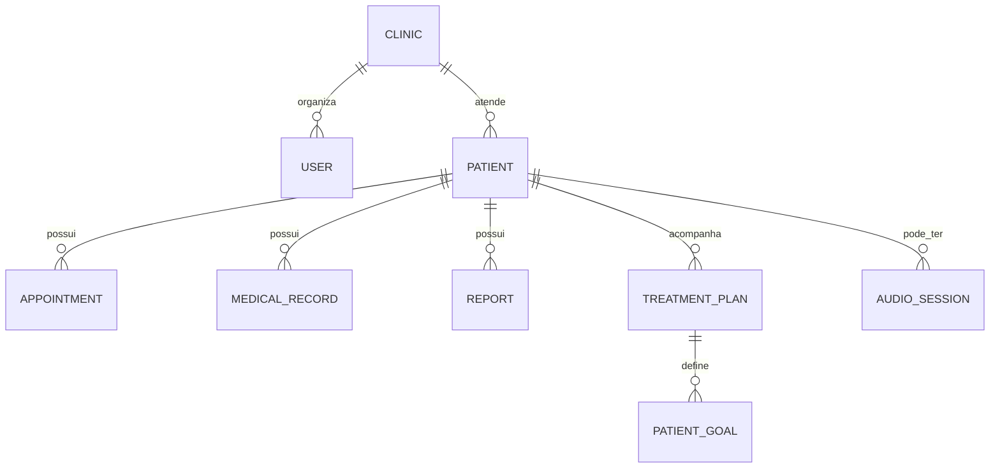

# Domain Model e Ubiquitous Language

## Modelo observado

O diagrama é conceitual, derivado dos nomes do schema; cardinalidades e ownership devem ser confirmados no Prisma/migrations. Outras entidades confirmadas: tarefas, transações/categorias, mensagens, protocolos, materiais, exercícios prescritos, CAA, escalas, teleconsulta, consentimentos, audit log, assinatura/invoice e conteúdo de marketing.

## Linguagem ubíqua

| Termo | Definição | Não usar como sinônimo |
| --- | --- | --- |
| Profissional | pessoa que usa o sistema para atender/operar | paciente, cliente final |
| Paciente | pessoa vinculada ao cuidado/workflow | usuário autenticado por padrão |
| Clínica | entidade organizacional existente no schema | necessariamente unidade física |
| Agendamento | compromisso temporal do atendimento | sessão concluída |
| Sessão | evento/atendimento; detalhes dependem do módulo | apenas slot de agenda |
| Prontuário/registro | informação clínica persistida | nota informal descartável |
| Relatório | documento/conteúdo derivado para revisão | diagnóstico automático |
| Rascunho IA | output não aceito ainda pela profissional | registro final |

## Contextos delimitados — current/proposed

Identity, Workspace/Clinic, Patient Management, Scheduling, Clinical Workflow, Content/Materials, Communication, Billing, Marketing/Leads e AI/Knowledge são limites úteis. O código é modular por diretórios; não afirmar eventos ou isolamento de módulos além do que contratos/migrations provem.

## Eventos de domínio — Proposed

`patient_created`, `appointment_scheduled`, `session_completed`, `medical_record_updated`, `report_generated`, `treatment_plan_created`, `invoice_paid`. Para eventos reais de analytics/audit, definir trigger, actor, tenant, propriedades permitidas e idempotência antes de emitir.
