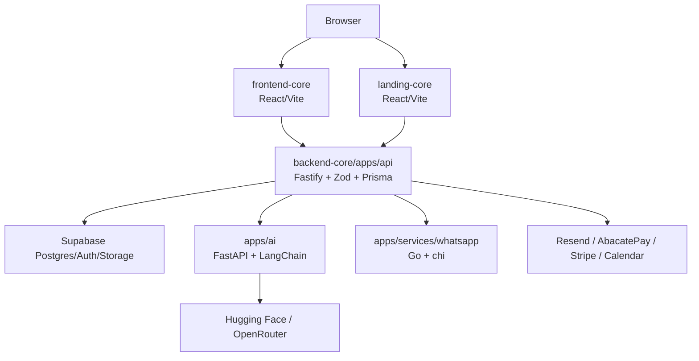

# Architecture Overview

## Current State — VERIFIED

O frontend é uma SPA; a API valida ambiente com Zod e autentica JWT Supabase via JWKS. O backend-core é um repositório Git separado, embora esteja dentro deste checkout. Contratos Zod em `backend-core/contracts` são a referência de boundary de tipos. Não foi encontrada evidência para chamar a solução de microservices: ela é um conjunto de apps especializados e módulos de API.

## Direção

Manter monólito modular no core da API. Extrair uma capacidade apenas se houver escala/latência independente, ownership claro, requisito de isolamento, confiabilidade ou cadência de deploy que justifique custo operacional. “Event-driven”, cache, filas e serviços distribuídos são ferramentas, não metas.

## Request lifecycle

`Browser → token Supabase → Fastify auth/JWKS → Zod boundary → service/module → Prisma/Supabase → resposta sanitizada`. Provider externo deve ter timeout, tratamento de falha, logs sem dados clínicos e idempotência quando houver efeito externo.
