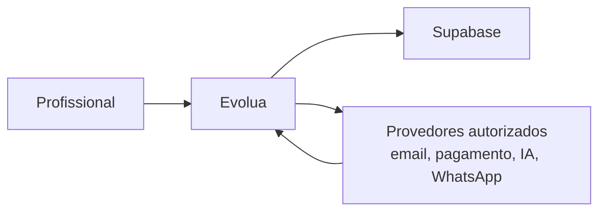

# Privacy by Design e LGPD

## Princípios

Coletar menos, reter menos e expor menos. Dados de cliente são confiados à Evolua para uma finalidade; não são ativos para reutilização arbitrária. Dados de paciente, prontuário, áudio e transcrição são **Highly Sensitive**.

## Fluxo de dados

Cada processador precisa de finalidade, categoria de dado, localização/retencão, contrato aplicável, alternativa e owner. Provedores encontrados estão em [Integrações](../05-architecture/06_INTEGRATION_ARCHITECTURE.md). Não há evidência suficiente para declarar DPA, local de processamento ou política de treinamento de terceiros.

## LGPD — requisitos técnicos/operacionais, não parecer jurídico

**LEGAL REVIEW REQUIRED:** papéis controlador/operador, bases legais, dados sensíveis, consentimento quando aplicável, direitos de acesso/correção/portabilidade/exclusão, retenção, incidentes, menores/responsáveis e transferências internacionais. O produto deve suportar minimização, propósito, acesso autorizado, registro de tratamento e atendimento seguro de solicitações.
