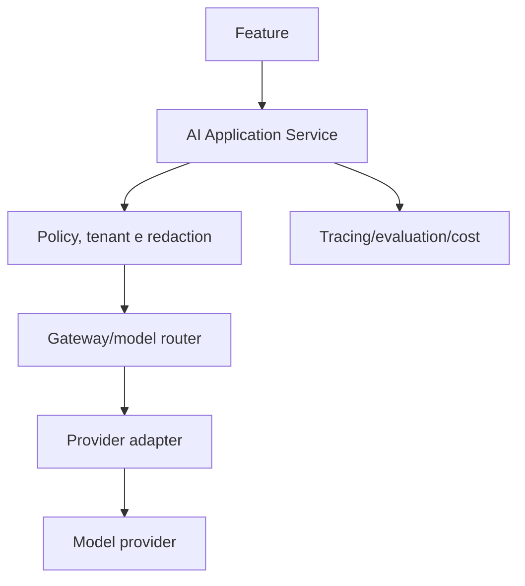

# Estratégia, arquitetura e segurança de IA

## Current State — VERIFIED

O serviço `backend-core/apps/ai` é FastAPI. OpenRouter é o provider operacional para geração clínica/conteúdo e transcrição de áudio; Hugging Face Router permanece reservado à geração de embeddings do RAG. Postgres/pgvector é a base de conhecimento. Routers de biblioteca/RAG e geração clínica existem. A API Fastify intermedeia recursos de IA e aplica limites em rotas. Avaliações/datasheets ASR/RAG já existem em `docs/ai-evals/`.

## Princípio e casos seguros

`AI assists. The professional decides.` Casos adequados: transcrição, sumarização, busca autorizada, organização e rascunhos. Não usar IA para diagnóstico, prescrição, recomendação terapêutica autônoma ou decisão clínica. Rascunho gerado não vira registro final sem revisão/aceite explícito.

## Arquitetura alvo — Proposed

A aplicação atual já separa API e serviço IA, mas um gateway/policy uniforme, versões de prompt, redaction e tracing completo devem ser avaliados antes de refactor grande. Abstrair volatilidade real de modelo é útil; não criar uma camada vazia.

## Context engineering e RAG

Enviar somente contexto mínimo, temporalmente relevante e previamente autorizado. `organization_id`, `professional_id`, `patient_id`, documento, tipo, sensitividade e permissão devem filtrar antes de retrieval; similaridade vetorial nunca isola tenant. Em 2026-08-14, o gateway passou `x-clinic-id` validado ao serviço IA e a query pgvector passou a filtrar `clinic_id` antes do ranking. RAG só é justificado para busca/knowledge; não é requisito para toda feature. A pipeline conceitual é source → normalização → chunk → metadata → embedding/index → filtro de autorização → retrieval/rerank → context builder → modelo.

## Segurança, privacidade e fallback

Atualização de 2026-08-17: o retrieval pgvector recebe `clinic_id` derivado do contexto autenticado e filtra antes do ranking. A ingestão RAG por URL requer HTTPS, recusa IPs não públicos e hostnames que resolvam para redes não públicas, e não segue redirecionamentos. A validação reduz a superfície SSRF; conectores externos futuros devem ter allowlist e revisão específica.

Tratar prompt injection, documentos maliciosos, leakage cross-tenant, log de prompt e retenção de provider como ameaças. Modelo propõe; política/autorização/humano aprovam; ação é auditada. Se IA falhar, a usuária continua manualmente: “Não foi possível gerar agora. Você pode continuar preenchendo o conteúdo.” Não fazer retries infinitos ou ocultar falha.

## Avaliação e observabilidade

Offline: datasets sintéticos/consentidos e casos de borda. Online: latência, custo, erros, taxa de revisão/aceite e feedback. Humana especializada: consistência, utilidade, completude, alucinação e segurança clínica. Não guardar prompts clínicos completos em logs sem necessidade. Modelos, prompts, dataset e versões devem ser rastreáveis.
