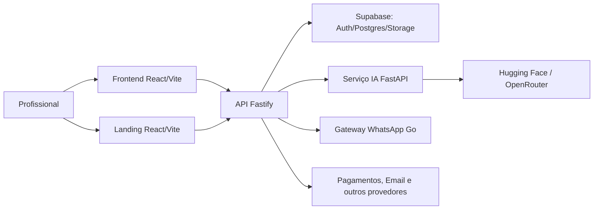

# Evolua Master Context

## Identidade

**Evolua** é um **Vertical SaaS para fonoaudiologia**. **VERIFIED:** o produto implementa workflows de pacientes, agenda, registros, relatórios, planos, exercícios, comunicação, financeiro e IA. **PROPOSED one-liner:** “Evolua organiza a rotina de fonoaudiólogas para que cada paciente seja acompanhado com mais clareza e menos trabalho administrativo.”

## Problema e solução

**INFERRED:** o trabalho profissional fica fragmentado entre agenda, anotações, arquivos, mensagens e cobrança. Evolua reúne partes desse fluxo em uma experiência específica para a prática. Não há evidência para prometer resultado clínico, economia de tempo quantificada ou substituição de julgamento profissional.

## Cliente e estágio

O código sustenta práticas com pacientes e uma entidade `Clinic`; o ICP efetivamente prioritário é **UNKNOWN**. Recomendação inicial: validar fonoaudiólogas autônomas e consultórios pequenos como wedge, antes de posicionar produto como plataforma enterprise. Estágio comercial, tração e pricing público são **UNKNOWN**.

## Princípios de produto

1. Workflow clínico antes de catálogo de funcionalidades.
2. Menos carga administrativa, mais clareza de próximo passo.
3. IA assiste; a profissional decide e aprova.
4. Privacidade é requisito arquitetural.
5. Dados corretos e rastreáveis superam “automação mágica”.
6. Simplicidade e reversibilidade antes de complexidade distribuída.

## Arquitetura resumida

## Domínio

Entidades confirmadas incluem clínica, usuário, paciente, agendamento, prontuário, relatório, sessão de áudio, tarefa, plano/metas, materiais/exercícios, CAA, teleconsulta, billing, lead e newsletter. Consulte [Domain Model](04-domain/01_DOMAIN_MODEL.md). O tenant root e a política completa de papéis exigem validação do schema/RLS e decisão de produto.

## IA

ASR, RAG/biblioteca e geração assistida existem. A arquitetura atual usa FastAPI, Hugging Face e OpenRouter; dados clínicos são altamente sensíveis. IA deve produzir rascunho revisável, ter fallback manual e ser avaliada por especialistas. Veja [AI Strategy](08-ai/01_AI_STRATEGY.md).

## Estratégia recomendada

**PROPOSED:** vencer por profundidade do fluxo diário — paciente → agenda → sessão → prontuário/relatório → próximo passo — e por confiança. Growth deve ligar educação útil à ativação do produto, não só a alcance. A prioridade técnica é reforçar isolamento, integridade, testes de jornada, observabilidade e governança de IA.

## Riscos e decisões

Riscos mais materiais: dados de saúde, validação de tenant, falha/erro de IA, configurações legadas e dispersão de escopo. Decisões em aberto: ICP/wedge, pricing, papéis de clínica, ciclo de dados, fornecedores IA permitidos e owner de operação. Veja [Decision Memo](EXECUTIVE_DECISION_MEMO.md).

## Terminologia

Use “profissional” para quem opera o sistema; “paciente” para a pessoa atendida; “clínica” apenas para a entidade encontrada no domínio; “registro/prontuário” para informação clínica. Não use “cliente” como sinônimo de paciente.
