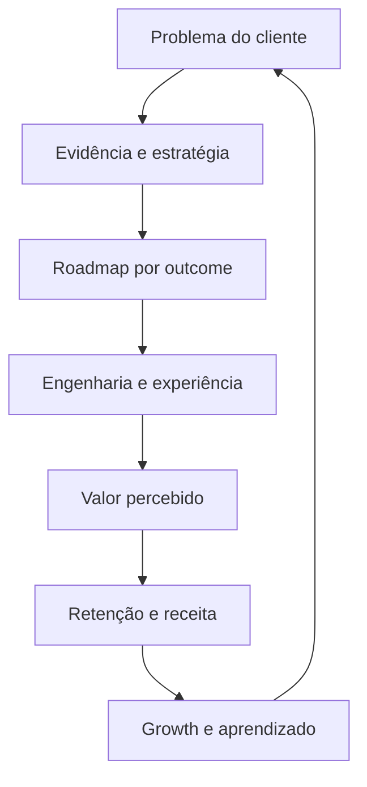

# Evolua Operating System

Evolua opera como sistema de aprendizado: suporte, vendas, uso de produto, pesquisa e incidentes geram sinais; sinais priorizados geram hipóteses; mudanças pequenas e mensuráveis produzem aprendizado. GEOS é a camada local-first de growth/knowledge. Toda ação externa — publicar, enviar, convidar — exige aprovação humana conforme `.geos/geos.yaml` e a política operacional existente.

### Cadência enxuta proposta

- Semanal: revisar clientes/suporte, qualidade do fluxo central, deploys/incidentes e experimentos.
- Mensal: revisar ativação, retenção, receita, segurança e backlog.
- Trimestral: revisar ICP, posicionamento, roadmap e riscos. Sem burocracia: só manter rituais que mudem decisões.
