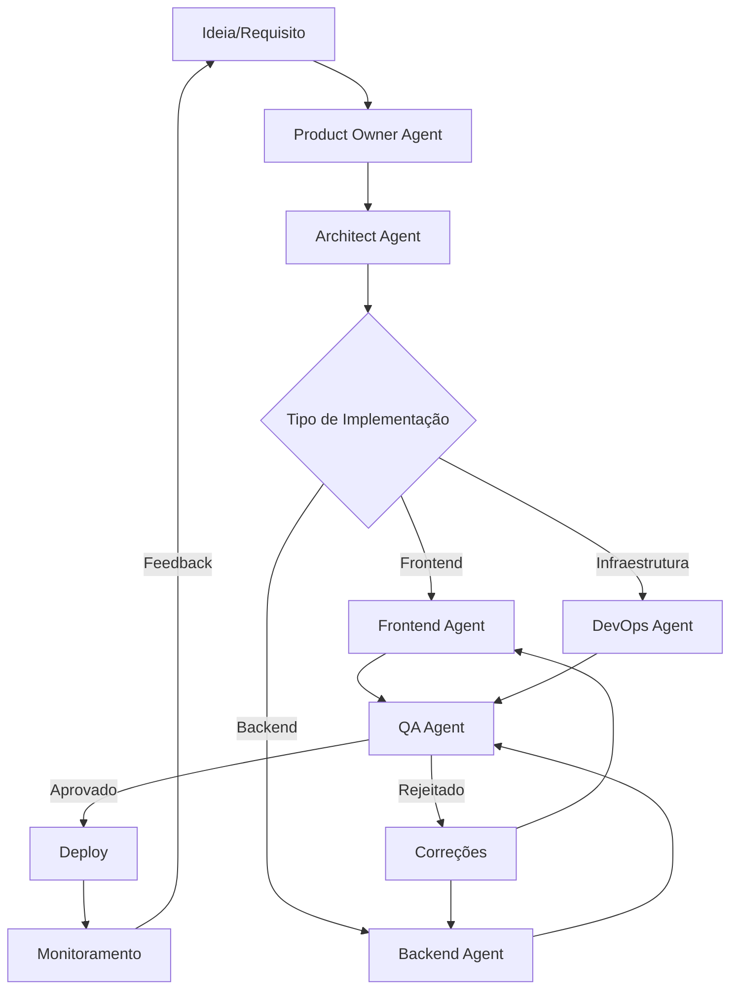

# Workflow de Desenvolvimento com IA

## Visão Geral

O Evolua CRM segue um workflow de desenvolvimento orientado por IA, onde agents especializados colaboram para transformar ideias em código funcional.

## Ciclo de Vida do Desenvolvimento



## Fases do Workflow

### Fase 1: Descoberta e Especificação
**Responsável**: Product Owner Agent

**Entrada**: Ideia ou requisito do usuário

**Processo**:
1. Entender necessidade do usuário
2. Escrever user story com critérios de aceitação
3. Definir métricas de sucesso
4. Priorizar no backlog (RICE score)
5. Criar especificação em `spec/product.md`

**Saída**: User story documentada e priorizada

**Exemplo**:
```markdown
# User Story: Integração com Google Calendar

**Como** fonoaudióloga
**Quero** sincronizar agendamentos com Google Calendar
**Para que** tenha visão unificada da agenda

**Critérios de Aceitação**:
- [ ] OAuth com Google
- [ ] Sincronização bidirecional
- [ ] Atualização em tempo real

**RICE Score**: 640 (Alta prioridade)
```

### Fase 2: Design Arquitetural
**Responsável**: Architect Agent

**Entrada**: User story do Product Owner

**Processo**:
1. Avaliar viabilidade técnica
2. Definir arquitetura da solução
3. Escolher tecnologias e padrões
4. Estimar esforço técnico
5. Criar ADR (Architecture Decision Record)
6. Atualizar `spec/architecture.md`

**Saída**: Especificação técnica e estimativa

**Exemplo**:
```markdown
# ADR: Integração com Google Calendar

## Decisão
Usar Google Calendar API v3 com OAuth 2.0

## Contexto
Usuários querem sincronizar agendamentos

## Alternativas Consideradas
1. Webhook do Google Calendar
2. Polling periódico
3. Sincronização manual

## Decisão Final
OAuth 2.0 + Webhook para sincronização em tempo real

## Consequências
- Requer configuração de OAuth no Google Cloud
- Necessário armazenar refresh tokens
- Webhook requer endpoint público
```

### Fase 3: Implementação
**Responsáveis**: Backend Agent, Frontend Agent, DevOps Agent

**Entrada**: Especificação técnica do Architect

**Processo Backend**:
1. Criar módulo NestJS (`google-calendar.module.ts`)
2. Implementar OAuth flow
3. Criar endpoints de sincronização
4. Escrever testes unitários
5. Documentar API com Swagger

**Processo Frontend**:
1. Criar componente de configuração
2. Implementar fluxo de OAuth
3. Adicionar toggle de sincronização
4. Escrever testes de componente
5. Atualizar documentação

**Processo DevOps**:
1. Configurar variáveis de ambiente
2. Adicionar secrets do Google OAuth
3. Configurar webhook endpoint
4. Atualizar pipeline de CI/CD

**Saída**: Código implementado e testado

### Fase 4: Validação de Qualidade
**Responsável**: QA Agent

**Entrada**: Código dos agents de implementação

**Processo**:
1. Revisar código contra critérios de aceitação
2. Executar testes automatizados
3. Verificar cobertura de testes (>80%)
4. Testar manualmente fluxos críticos
5. Validar acessibilidade e performance
6. Reportar bugs encontrados

**Saída**: Relatório de qualidade (aprovado/rejeitado)

**Exemplo**:
```markdown
# Relatório de QA: Integração Google Calendar

## Testes Executados
- ✅ Unit tests: 15/15 passando
- ✅ Integration tests: 8/8 passando
- ✅ Cobertura: 87%
- ⚠️ E2E: 2/3 passando (1 falha)

## Bugs Encontrados
1. [CRÍTICO] Refresh token não está sendo renovado
2. [MÉDIO] Sincronização falha com eventos recorrentes

## Decisão
❌ Rejeitado - Corrigir bugs críticos antes de deploy
```

### Fase 5: Deploy
**Responsável**: DevOps Agent

**Entrada**: Código aprovado pelo QA

**Processo**:
1. Merge para branch `develop` (deploy dev)
2. Validar em ambiente de dev
3. Merge para branch `main` (deploy prod)
4. Monitorar métricas pós-deploy
5. Rollback se necessário

**Saída**: Feature em produção

### Fase 6: Monitoramento e Feedback
**Responsáveis**: DevOps Agent, Product Owner Agent

**Processo**:
1. Monitorar métricas de uso (Himetrica)
2. Coletar feedback de usuários
3. Analisar logs de erro (Sentry)
4. Medir impacto nas métricas de negócio
5. Iterar baseado em feedback

**Saída**: Insights para próximas iterações

## Comunicação Entre Agents

### Product Owner ↔ Architect
```
PO: "Precisamos de integração com Google Calendar"
Architect: "Viável. Estimativa: 3 semanas. Requer OAuth e webhook."
PO: "Aprovado. Prioridade alta (RICE 640)."
```

### Architect ↔ Backend
```
Architect: "Implementar OAuth 2.0 com Google Calendar API v3"
Backend: "Implementado. Endpoints: POST /calendar/connect, GET /calendar/sync"
Architect: "Revisado. Aprovado."
```

### Backend ↔ Frontend
```
Backend: "API pronta. Contrato: POST /calendar/connect { code: string }"
Frontend: "Integrado. Componente CalendarSettings implementado."
```

### Frontend ↔ QA
```
Frontend: "Componente pronto para testes"
QA: "Testado. Bug encontrado: refresh token não renova"
Frontend: "Corrigido. Re-testado."
QA: "Aprovado."
```

### QA ↔ DevOps
```
QA: "Código aprovado. Pronto para deploy."
DevOps: "Deployed para dev. Validar antes de prod."
QA: "Validado em dev. Pode ir para prod."
DevOps: "Deployed para prod. Monitorando."
```

## Ferramentas de Colaboração

### Documentação
- **Specs**: `spec/*.md` (product, architecture, backend, frontend, infrastructure, api)
- **ADRs**: `spec/adr/*.md` (decisões arquiteturais)
- **User Stories**: `spec/stories/*.md`

### Código
- **Git**: Branches `develop` (dev) e `main` (prod)
- **Pull Requests**: Revisão de código entre agents
- **CI/CD**: GitHub Actions + AWS Amplify

### Comunicação
- **Issues**: GitHub Issues para bugs e features
- **Discussions**: GitHub Discussions para decisões
- **Comments**: Comentários em PRs para feedback

## Métricas de Sucesso do Workflow

- **Lead Time**: Tempo de ideia até produção (<2 semanas)
- **Cycle Time**: Tempo de desenvolvimento até deploy (<1 semana)
- **Deployment Frequency**: Deploys por semana (>3)
- **Change Failure Rate**: % de deploys com rollback (<5%)
- **MTTR**: Tempo médio de recuperação (<1 hora)
- **Code Coverage**: Cobertura de testes (>80%)
- **Bug Escape Rate**: Bugs em produção por sprint (<3)
