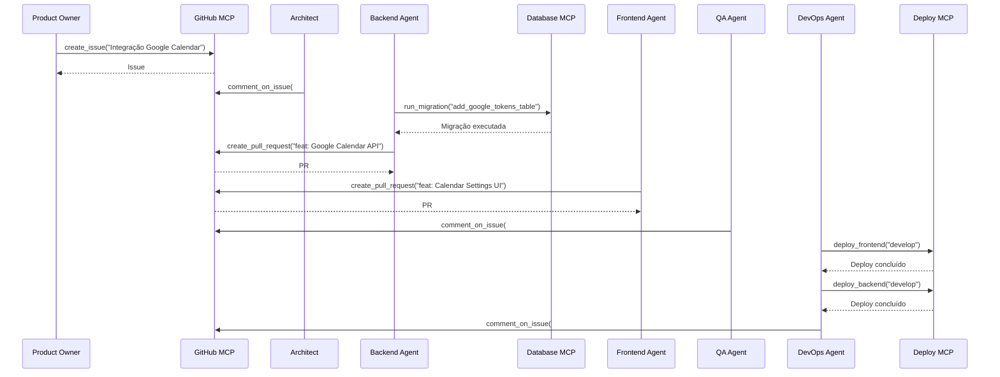
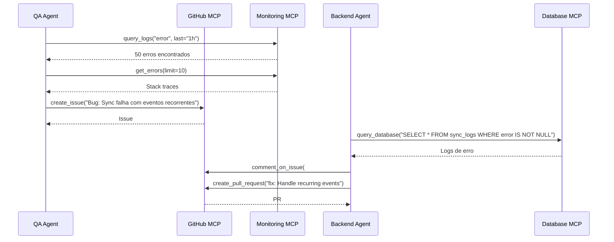

# Arquitetura MCP - Model Context Protocol

## Visão Geral

O Model Context Protocol (MCP) permite que AI agents interajam com ferramentas externas de forma padronizada. No Evolua CRM, podemos usar MCP servers para estender capacidades dos agents.

## MCP Servers Recomendados

### 1. GitHub MCP
**Propósito**: Gerenciamento de repositório, issues, PRs

**Ferramentas**:
- `create_issue`: Criar issue para bug ou feature
- `create_pull_request`: Criar PR com código
- `list_issues`: Listar issues abertas
- `comment_on_issue`: Adicionar comentário

**Uso no Workflow**:
```
Product Owner Agent → GitHub MCP
- Criar issue para nova feature
- Adicionar labels (feature, bug, enhancement)
- Atribuir para developer

QA Agent → GitHub MCP
- Criar issue para bug encontrado
- Adicionar reprodução e logs
- Linkar com PR relacionado
```

### 2. CI/CD MCP
**Propósito**: Controle de pipelines de build e deploy

**Ferramentas**:
- `trigger_build`: Disparar build manual
- `get_build_status`: Verificar status de build
- `cancel_build`: Cancelar build em andamento
- `get_logs`: Obter logs de build

**Uso no Workflow**:
```
DevOps Agent → CI/CD MCP
- Disparar deploy para staging
- Verificar se build passou
- Obter logs em caso de falha
- Rollback se necessário
```

### 3. Deploy MCP
**Propósito**: Publicação em cloud (AWS Amplify, App Runner)

**Ferramentas**:
- `deploy_frontend`: Deploy do frontend no Amplify
- `deploy_backend`: Deploy do backend no App Runner
- `get_deployment_status`: Status do deploy
- `rollback`: Rollback para versão anterior

**Uso no Workflow**:
```
DevOps Agent → Deploy MCP
- Deploy para ambiente de dev
- Validar health checks
- Deploy para produção
- Monitorar métricas pós-deploy
```

### 4. Database MCP
**Propósito**: Migrações e gerenciamento de schema

**Ferramentas**:
- `run_migration`: Executar migração
- `rollback_migration`: Reverter migração
- `get_schema`: Obter schema atual
- `backup_database`: Criar backup

**Uso no Workflow**:
```
Backend Agent → Database MCP
- Criar migração para nova tabela
- Executar migração em dev
- Validar schema
- Executar em produção
```

### 5. Monitoring MCP
**Propósito**: Logs, métricas e alertas

**Ferramentas**:
- `query_logs`: Buscar logs
- `get_metrics`: Obter métricas (CPU, memória, latência)
- `create_alert`: Criar alerta
- `get_errors`: Listar erros recentes

**Uso no Workflow**:
```
DevOps Agent → Monitoring MCP
- Verificar logs de erro após deploy
- Obter métricas de performance
- Criar alerta para latência alta
- Analisar causa raiz de incidente
```

### 6. Supabase MCP
**Propósito**: Gerenciamento de banco Supabase

**Ferramentas**:
- `query_database`: Executar query SQL
- `create_table`: Criar tabela
- `add_rls_policy`: Adicionar política RLS
- `manage_users`: Gerenciar usuários Auth

**Uso no Workflow**:
```
Backend Agent → Supabase MCP
- Criar tabela para nova feature
- Adicionar RLS policy
- Criar índices para performance
- Gerenciar usuários de teste
```

## Interação de Agents com MCP Servers

### Exemplo 1: Nova Feature End-to-End



### Exemplo 2: Investigação de Bug



## Configuração de MCP Servers

### Arquivo de Configuração
```json
// .kiro/mcp.json
{
  "mcpServers": {
    "github": {
      "command": "npx",
      "args": ["-y", "@modelcontextprotocol/server-github"],
      "env": {
        "GITHUB_TOKEN": "${GITHUB_TOKEN}"
      }
    },
    "supabase": {
      "command": "npx",
      "args": ["-y", "@modelcontextprotocol/server-supabase"],
      "env": {
        "SUPABASE_URL": "${SUPABASE_URL}",
        "SUPABASE_SERVICE_KEY": "${SUPABASE_SERVICE_KEY}"
      }
    },
    "aws": {
      "command": "npx",
      "args": ["-y", "@modelcontextprotocol/server-aws"],
      "env": {
        "AWS_ACCESS_KEY_ID": "${AWS_ACCESS_KEY_ID}",
        "AWS_SECRET_ACCESS_KEY": "${AWS_SECRET_ACCESS_KEY}",
        "AWS_REGION": "us-east-1"
      }
    }
  }
}
```

## Benefícios do MCP

### Para Agents
- **Automação**: Executar ações sem intervenção manual
- **Contexto**: Obter informações em tempo real
- **Integração**: Conectar com ferramentas externas
- **Auditoria**: Rastrear todas as ações executadas

### Para Desenvolvedores
- **Produtividade**: Menos tarefas manuais
- **Consistência**: Processos padronizados
- **Visibilidade**: Logs de todas as ações
- **Escalabilidade**: Adicionar novos servers facilmente

## Próximos Passos

1. **Implementar GitHub MCP**: Integração básica com issues e PRs
2. **Implementar Supabase MCP**: Gerenciamento de banco e auth
3. **Implementar AWS MCP**: Deploy e monitoramento
4. **Criar MCP Customizado**: Server específico para Evolua (relatórios, WhatsApp)
5. **Documentar Workflows**: Fluxos completos usando MCP servers
